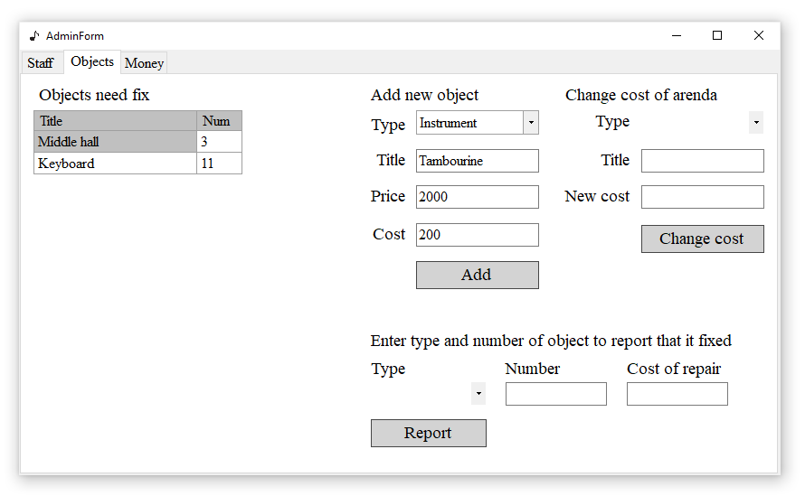

# Music Salon (recording studio)
The coursework for the Microsoft SQL Server course
- Microsoft SQL Server 2018
- C#

## Database structure
- 13 tables
- 3 users
  - client
  - staff
  - administrator
  

  
## Application windows
### Login window

### Administrator window

### Staff window

### Client window

